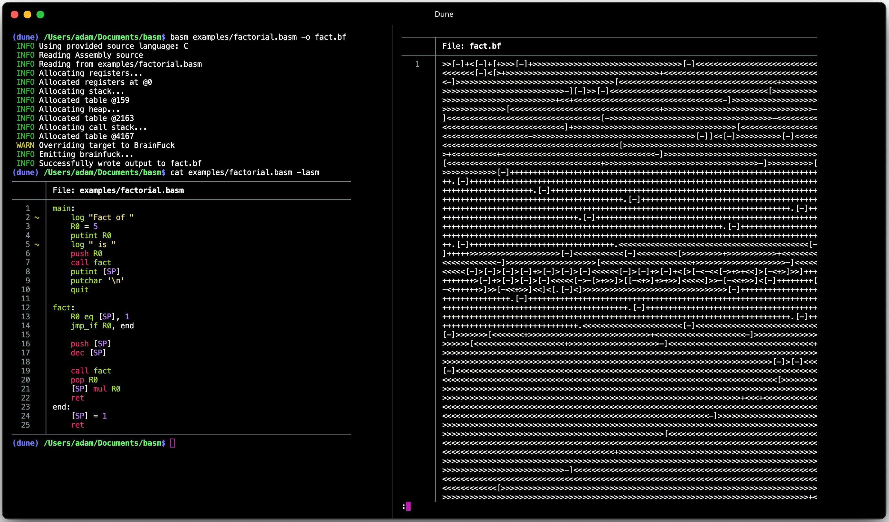
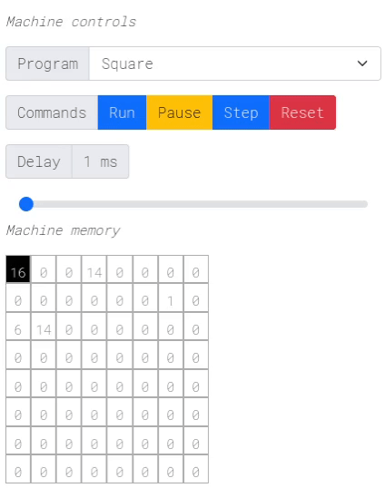
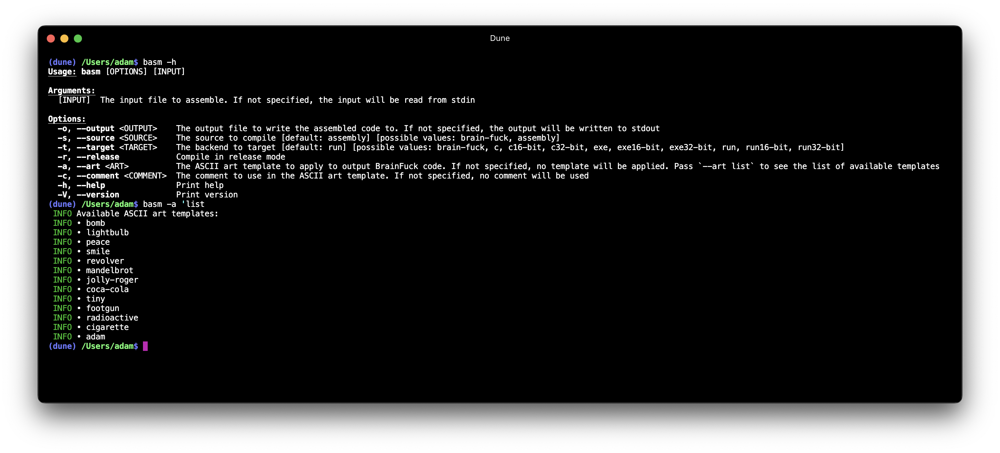
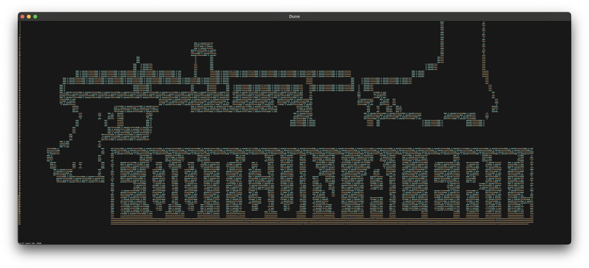
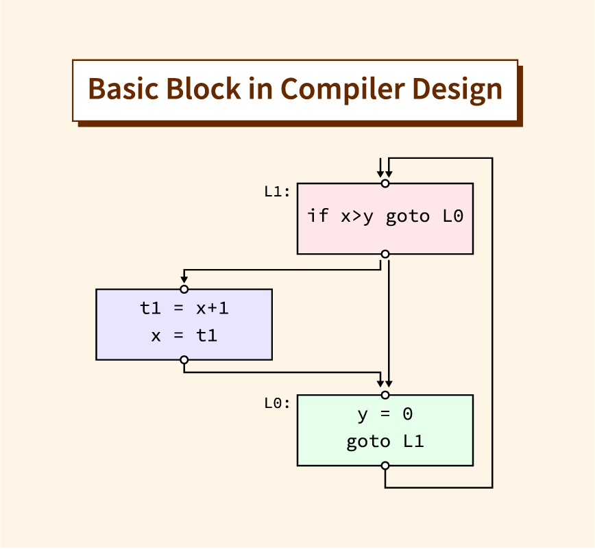

<div align="center">
  <h1>🧠basm💾</h1>

  <p>
    <strong>An assembler that compiles down to just 8 instructions🧠</strong>
  </p>

  <p>
    
    
  </p>

  <h3>
    <a target="_blank" href="https://adam-mcdaniel.github.io/basm">Documentation</a>
    <span> | </span>
    <a target="_blank" href="http://adam-mcdaniel.github.io">My Website</a>
  </h3>

  <sub>Written in Rust🦀💖</sub>
</div>

<div align="center">
    
    
  <!-- <a target="_blank" href="https://adam-mcdaniel.github.io/harbor">
    
  </a>
  <a target="_blank" href="https://adam-mcdaniel.github.io/harbor">
     -->
  </a>
</div>

## Table of Contents

- [Introduction](#introduction)
    - [Reasons to Use `basm`](#reasons-to-use-basm)
- [Features](#features)
    - [ASCII Art Output!](#ascii-art-output)
    - [Optimizing BrainF*** Compiler](#optimizing-brainf-compiler)
- [Examples](#examples)
    - [The Stack](#the-stack)
    - [Labels, Jumps, and Functions](#labels-jumps-and-functions)
- [Techniques and Algorithms](#techniques-and-algorithms)
    - [Arithmetic](#arithmetic)
    - [Basic Blocks and Control Flow](#basic-blocks-and-jumps)
    - [Pointers](#pointers)
- [Usage](#usage)
    - [Installation](#installation)
    - [Running the Assembler](#running-the-assembler)
    - [API](#api)
- [Contributing](#contributing)
- [License](#license)
- [About the Author](#about-the-author)
- [Related Works](#related-works)

## Introduction

`basm` is a minimalistic assembler that compiles down to pure, standard [BrainF***](https://en.wikipedia.org/wiki/Brainfuck) instructions. It's designed to significantly assist developers in creating BrainF*** programs by providing a more human-readable assembly language. Additionally, it adds many abstractions to make it easier to represent real-world algorithms.

### Reasons to Use `basm`

- **Fun**: Use `basm` to implement your University project and submit it to the TA as a BrainF*** program. They might kill you, but it'd be worth the meme.

- **Obfuscation/Security**: If you want to write programs that are near impossible to reverse-engineer, `basm` can help you achieve that. The generated BrainF*** code is so far removed from the original source that the output becomes extremely difficult to understand and reason about. ***If you want to hide your code, `basm` is the tool to do it.***

- **Portability**: Nearly all platforms currently support BrainF*** compilers, or you can easily write your own in a couple dozen lines. This makes `basm` a fun choice for writing portable code that doesn't need to be performant.

## Features

### ASCII Art Output!
---

`basm` allows you to generate your BrainF*** code in the form of several ASCII art templates, and allows you to supply your own!


Here's an example program compiled with the `footgun` template.



You also can pad the program to fit your ASCII art template with your own comments, such as `Adam is awesome!`.

Any text file containing ASCII art can be used as a template!

### Optimizing BrainF*** Compiler
---

`basm` comes with a built-in BrainF*** compiler that optimizes the generated code. It optimizes away `[-]`, and coalesces adjacent identical operations when compiling to a target.
You can ask for an 8-bit, 16-bit, or 32-bit target, and the compiler will generate the code accordingly.

It automatically detects whether you're compiling assembly or BrainF*** from the CLI arguments, and compiles to the detected output format if not specified explicitly.

## Examples

> [!TIP]
> `basm` creates many abstractions on top of the BrainF*** tape for your convenience.
For more examples, check out the [`examples/` directory](./examples/), which contains many assembly files you can look at.

### The Stack

`basm` provides a stack with behavior similar to other assemblers. You may `push` or `pop` values on the stack, or access stack elements directly with pointers.

```x86asm
;; Push some elements on the stack
push '?'
push '!'
push '.'

;; Pop them off and print them
pop R0
putchar R0 ;; Prints '.'
pop R1
putchar R1 ;; Prints '!'
pop R2
putchar R2 ;; Prints '?'
```

The stack, and pointers to stack elements, are implemented using a BrainF*** table that can be accessed via the registers. Stack elements can be directly read or assigned to by using the `[]` operator.

```x86asm
;; Push some elements on the stack
push 1
push 2
push 3

putint [SP] ;; Prints 3 (SP points to the top stack element)

R0 lea [SP] - 1 ;; R0 points to 2
putint [R0]     ;; Prints 2

R0 lea [R0] - 1 ;; R0 points to 1
putint [R0]     ;; Prints 1
```

### Labels, Jumps, and Functions

`basm` supports labels, unconditional jumps, conditional jumps, and function calls. You can use labels to mark specific points in your code and jump to them as needed.

```x86asm
;; `yes` program
;;
;; This program prints "y" forever.

start: ;; Define a label
    ;; Code here
    putchar 'y'
    putchar '\n'
    jmp start ;; Unconditional jump to the start label
```

Conditional jumps are performed using the `jmp_if` instruction, which takes a location storing a boolean value (like a register or stack element) and a label to jump to if the value is not zero.

```x86asm
;; `cat` program
;;
;; This program reads a character from the input and prints it.
main:
    log "Enter characters (Ctrl+D to end):\n"
    loop:
        getchar R0
        R1 eq R0, 0    ;; R1 = (R0 == 0)
        jmp_if R1, end ;; Jump to the end label if the input is zero
        putchar R0     ;; Print the entered character if not zero
        jmp loop
    end:
        log "Goodbye!\n"
        quit
```

Jump instructions do not save any information about where they came from. If you want to temporarily execute some other code, and then resume where you were, you can use the `call` and `ret` instructions.

Below is a simple example of a recursive factorial function, which calls itself until it reaches the base case. The `call` instruction saves the current basic block on the call stack (hidden from the user) and jumps to the function. The `ret` instruction pops the last basic block from the call stack and jumps to it.

```x86asm
;; `fact` program
main:
    push 5
    call fact ;; Call the factorial function with 5
    log "Factorial of 5 is "
    putint [SP]
    log "\n"
    quit

fact:
    R0 eq [SP], 1    ;; Check if the argument is 1
    jmp_if R0, end   ;; Jump to end if the input is 1
    
    ;; Recursive case
    push [SP]   ;; Push the argument we were given for the recursive call
    dec [SP]    ;; Decrement the argument for the recursive call
    call fact   ;; Call fact with the decremented argument
    pop R0      ;; Get the recursive result from the stack
    
    ;; Multiply the recursive result with the original argument (at [SP])
    [SP] mul R0 ;; [SP] = [SP] * R0
    ret ;; Return to the caller
end:
    [SP] = 1 ;; Base case
    ret ;; Return to the caller
```

## Techniques and Algorithms

BrainF*** is a *very* low-level language, and as such, it's incredibly difficult to translate abstractions such as functions, pointers, or basic arithmetic with it.

However, it *can* be done with a ***lot*** of effort.

### Arithmetic

The core arithmetic operations were the easiest to implement. The Esolang-Wiki algorithms for [addition](https://esolangs.org/wiki/Brainfuck_algorithms#x´_=_x_+_y), [subtraction](https://esolangs.org/wiki/Brainfuck_algorithms#x´_=_x_-_y), etc. were indispensable in implementing these instructions.

These instructions simply work by assigning registers to fixed tape locations, and then using the algorithms from the wiki to perform the operations. When an instruction uses dynamically located values, such as pointers, the assembler first retrieves the value into an assembler-reserved register, and then uses that register in the algorithm.

As an example, the `add` instruction is implemented like this:

> [!NOTE]
> `SRC` and `DEST` are the locations of the two values being added, respectively.
> This algorithm performs the operation `DEST = DEST + SRC`.
> `temp0` is a temporary register, reserved by the assembler.

```brainfuck
temp0[-]
SRC[DEST+temp0+SRC-]
temp0[SRC+temp0-]
```

### Basic Blocks and Control Flow

> [!NOTE]
> This aspect of the assembler was the hardest to implement!

The only instructions BrainF*** supports for control flow are while loops. So, *any logic for jumps, conditional jumps, or function calls must be implemented using while loops*.

My strategy for implementing this was to use a list of basic blocks – a list of instructions that are executed from beginning to end with no jumps or branches.



Each basic block is assigned an ID, and is compiled into an if-statement. The ID of the *current* basic block and the *next* basic block to execute are stored in two reserved registers.
By default, the next basic block is the one immediately after the current one, but branch instructions (`jmp`, `jmp_if`, `call`, `ret`, and `quit`) 
can modify the next basic block to execute.

At a high level, the generated code looks like this:

```c
CURRENT_BASIC_BLOCK = 1; // The first basic block
NEXT_BASIC_BLOCK = CURRENT_BASIC_BLOCK; // The next basic block to execute

while (CURRENT_BASIC_BLOCK != 0) {
    NEXT_BASIC_BLOCK++;
    if (CURRENT_BASIC_BLOCK == 1) {
        // Code for basic block 1
    } else if (CURRENT_BASIC_BLOCK == 2) {
        // Code for basic block 2
    } else if (CURRENT_BASIC_BLOCK == 3) {
        // Code for basic block 3
    }

    // The code for an unconditional jump looks like this:
    else if (CURRENT_BASIC_BLOCK == 4)
        NEXT_BASIC_BLOCK = 2; // Jump to block 2

    // The code for a conditional jump looks like this:
    else if (CURRENT_BASIC_BLOCK == 5)
        if (R0 != 0) // Jump to block 1 if R0 is not zero
            NEXT_BASIC_BLOCK = 1;

    // The code for a function call looks like this:
    else if (CURRENT_BASIC_BLOCK == 6)
        NEXT_BASIC_BLOCK = 3; // Call block 3
        CALL_STACK[CALL_STACK_POINTER++] = 7; // Save the return address

    // The code for a return looks like this:
    else if (CURRENT_BASIC_BLOCK == 7)
        NEXT_BASIC_BLOCK = CALL_STACK[--CALL_STACK_POINTER]; // Return to the caller

    // The code for a return looks like this:
    else if (CURRENT_BASIC_BLOCK == 8)
        NEXT_BASIC_BLOCK = 0; // Exit the program

    CURRENT_BASIC_BLOCK = NEXT_BASIC_BLOCK; // Update the current basic block
}
```

### Pointers

BrainF*** has no native support for pointers, so I had to implement them as indexes into the stack as a table
Whenever a pointer is dereferenced, it's a table lookup to get the value at the pointer's index
in the stack.


#### STACK(IDX) = VAL

Here's the BrainF*** algorithm for setting the value at a pointer's index.

> [!NOTE]
> `IDX` and `VAL` are the locations of the pointer and the value being written to, respectively.
> `STACK` is the location where the stack begins.
> `temp0`, `temp1`, and `temp2` are temporary registers, reserved by the assembler.

```brainfuck
temp0[-]
temp1[-]
temp2[-]
IDX[temp1+temp2+IDX-]temp2[IDX+temp2-]
STACK[temp0+temp2+VAL-]temp2[VAL+temp2-]
STACK>>[[>>]+[<<]>>-]+
 [>>]<[-]<[<<]
 >[>[>>]<+<[<<]>-]
 >[>>]<<[-<<]
```

#### VAL = STACK(IDX)

Here's the BrainF*** algorithm for retreiving the value at a pointer's index.

> [!NOTE]
> The mnemonics are the same as above.

```brainfuck
VAL[-] 
temp0[-]
temp1[-]
IDX[temp1+temp0+IDX-]temp0[IDX+temp0-]
STACK>>[[>>]+[<<]>>-]+[>>]<[<[<<]>+<
 VAL+
STACK>>[>>]<-]<[<<]>[>[>>]<+<[<<]>-]>[>>]<<[-<<]
```

## Usage

> [!TIP]
> The latest release of `basm` is always available here on GitHub!
> Check out the sections below to install and run `basm` on your system.

### Installation

First, install [Rust](https://www.rust-lang.org/tools/install) on your system.

Then, run the following command to install `basm`:

```bash
cargo install --git https://github.com/adam-mcdaniel/basm
```

Then, you can start using the assembler as an executable!

### Running the Assembler

To compile an assembly file to BrainF***, run the following command:

```bash
basm input.basm -o output.bf
```

To compile to an executable, you just change to the appropriate file extension:

```bash
basm input.basm -o output.exe
# Or, without an extension
basm input.basm -o output
```

To execute an assembly or BrainF*** file, just pass the input file without an output,
and the assembler will execute it by default:

```bash
# To run an assembly file
basm input.basm
# To run a BrainF*** file
basm input.bf
```

### API

`basm` can also be used as a library in your own Rust project.

Add this to your `Cargo.toml`:

```toml
[dependencies]
basm = { git = "https://github.com/adam-mcdaniel/basm
```

Then, you can generate assembly from within your project!

```rust
use basm::{Program, simplify_bf};

fn main() {
    let program = Program::parse("
        log \"Hello world!\"
        R0 = 5
        R1 = 10

        R2 add R0, R1
        log \" + \"
        putint R1
        log \" = \"
        putint R2
    ").expect("Failed to parse assembly");
    let bf = program.assemble();
    let optimized_bf = simplify_bf(bf);
    println!("{}", optimized_bf);
}
```

For more information, check out the [API documentation](https://adam-mcdaniel.github.io/basm).

## Contributing

To start contributing, check out the [contributing guide](./CONTRIBUTING.md)!

## License

This project is licensed under the [MIT License](./LICENSE).
Feel free to use, modify, and distribute this code as you wish!

## About the Author

Hello, [I'm Adam McDaniel](https://adam-mcdaniel.github.io/), a software engineer and computer science PhD student at the University of Tennessee Knoxville. I'm passionate about programming languages, compilers, and formal methods. I'm a huge fan of Rust and functional programming, and I love building tools that help people write better software.

Here's some interesting links for some of my other projects:

### My Interesting Links

|Website|
|---|
|[My programming language🧑‍💻](https://adam-mcdaniel.net/sage-website)|
|[My shell🐚](https://adam-mcdaniel.net/dune-website/)|
|[My YouTube📽️ (compilers and music)](https://youtu.be/QdnxjYj1pS0?si=pwvegcPkEvqmqF8b)|
|[My blog📝](https://adam-mcdaniel.net/blog)|
|[My logic language🧮](https://github.com/adam-mcdaniel/reckon)|
|[My online BrainF*** interpreter🧠](https://adam-mcdaniel.github.io/harbor)|